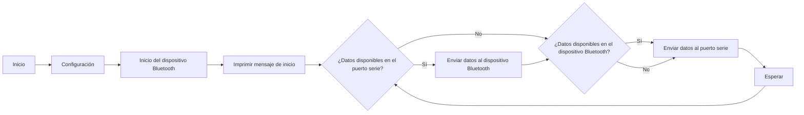

# P3.B. Bluetooth
## Objetivos
## Materiales: 
- ESP32-S1
- Aplicación movil: Serial Blurtooth Terminal
## Procedimiento:
**Codigo:**
```cpp
    #include <Arduino.h>#include "BluetoothSerial.h"
    #if !defined(CONFIG_BT_ENABLED) || !defined(CONFIG_BLUEDROID_ENABLED)
    #error Bluetooth is not enabled! Please run `make menuconfig` to and enable it
    #endif
    BluetoothSerial SerialBT;
    void setup() {
    Serial.begin(115200);
    SerialBT.begin("Nuria_COM8"); //Bluetooth device name
    Serial.println("The device started, now you can pair it with bluetooth!");
    }
    void loop() {
    if (Serial.available()) {
    SerialBT.write(Serial.read());
    }
    if (SerialBT.available()) {
    Serial.write(SerialBT.read());
    }
    delay(20);
    }
```
**Descripcion:**<br>
Este codigo crea una conexion entre la comunicacion Serial (USB)  y una conexion Bluetooth. Esto permite que los datos enviados por una comunicacion se puedan leer correctamente y sean escritos en la otra. <br><br> Cada funcion se encarga de un trabajo: <br>
<ul>
    <li> setup () --> Se inicializa la conexión junto a la velocidad y nombre, una vez conectado, se reflejara con un mensaje. </li>
    <li> loop () --> Se encarga de comprobar los datos de cada comunicacion a demás de enviar y escribir a la otra comunicacion en caso de encontrar datos. </li>
</ul><br>

**Diagrama de flujos:**



### Salidas:
Las salidas que se obtienen a través de la impresión serie (puerto USB) serán los datos transmitidos desde la comunicación Bluetooth y los datos recibidos desde la comunicación Serial, dependiendo de la dirección de la comunicación en ese momento.

Si envías datos desde otro dispositivo a través de Bluetooth al ESP32:
<ul>
    <li>Los datos serán recibidos y leídos por el ESP32 a través de la comunicación Bluetooth (SerialBT). Luego, esos datos se enviarán a través de la comunicación Serial (puerto USB) <br>
    Por lo tanto, verás los datos recibidos desde Bluetooth impresos en el monitor serie del puerto USB. </li>
</ul>


Si envías datos desde el ESP32 a través de la comunicación serial tradicional (puerto USB):
<ul>
    <li>Los datos serán leídos por el ESP32 desde la comunicación Serial (USB).
    Luego, esos datos se enviarán a través de la comunicación Bluetooth.<br>
    Por lo tanto, verás los datos enviados desde el ESP32 a través de Bluetooth impresos en el otro dispositivo.</li>
</ul>

## Conclusión: 
Se escribiran los datos que se han leido en otro dispositivo en el monitor serie y viceversa utilizando el Bluetooth.